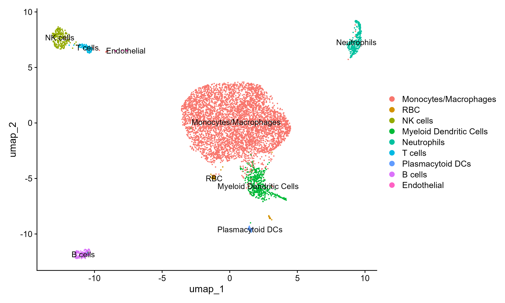
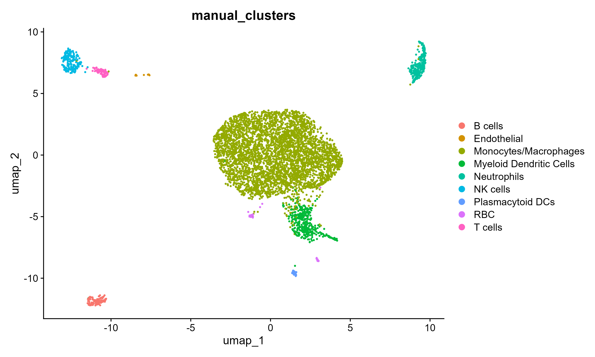
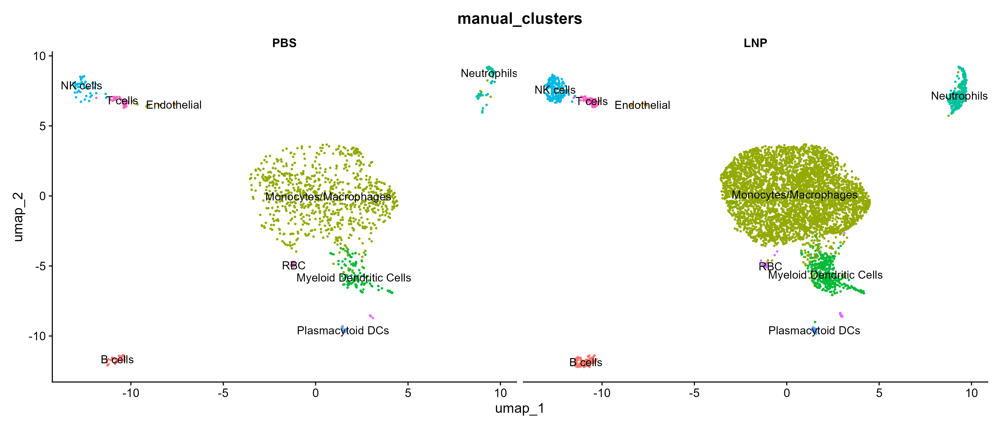
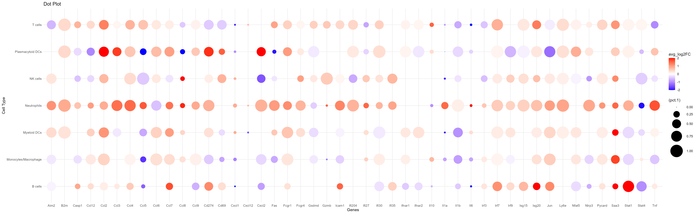
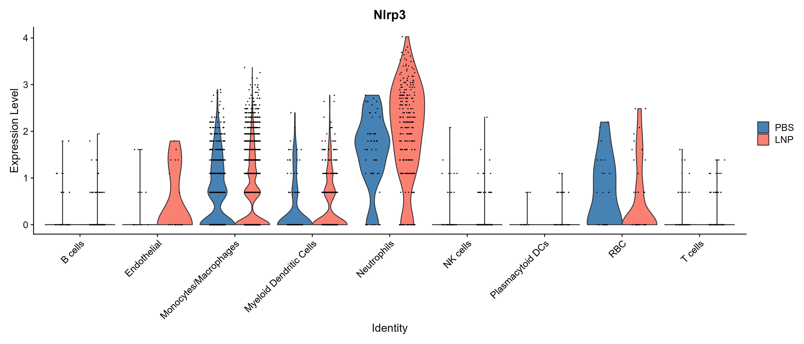
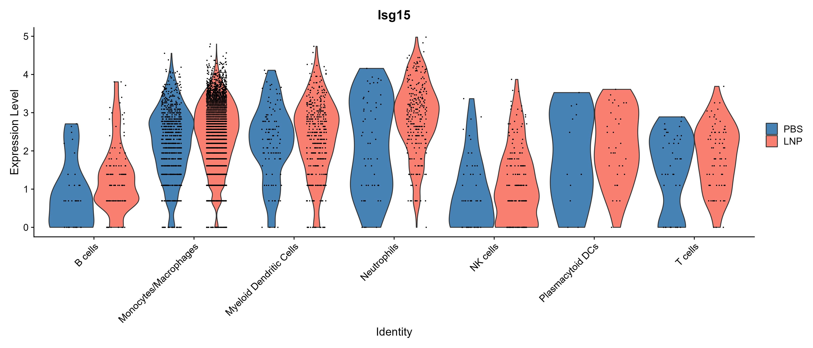

```{r setup, include=FALSE}
knitr::opts_chunk$set(echo = TRUE, eval = FALSE, message = FALSE, warning = FALSE)
library(knitr)
```

---

**Question:** Which immune cell populations in injected muscle are activated by SM-102 eLNP, and what gene programs do they execute?

**Data:** 10x Chromium scRNA-seq of CD45⁺ immune cells from SM-102 eLNP- and PBS-injected mouse tibialis anterior muscle. Four mice per condition, pooled into two multiplexed samples per condition (TotalSeq-A hashtag demultiplexing). After QC: 5,511 LNP-treated and 1,189 PBS barcodes.

**Methods:** Multi-sample Seurat pipeline — SCTransform normalization with MT% regression, UMAP clustering, automated cell type annotation (scType) cross-validated against manual marker-based annotation, and per-cell-type differential expression (FindMarkers, LNP vs. PBS) across 9 immune populations.

**Result:** Nine immune populations identified. Myeloid infiltrates — neutrophils and monocytes/macrophages — selectively upregulate interferon-stimulated genes, inflammasome components, and cytokines in LNP-injected muscle. Published as Figure 3 in [Dowell et al., *ACS Nano* (2024)](https://doi.org/10.1021/acsnano.4c08490).

---

## 1. Setup

```{r libraries}
library(Seurat)
library(ggplot2)
library(dplyr)
library(HGNChelper)
```

---

## 2. Load and Merge Samples

Four 10x samples (PBS_1, PBS_2, LNP_1, LNP_2) are loaded from CellRanger `sample_filtered_feature_bc_matrix` outputs. Each sample uses a minimum threshold of 100 detected features and genes present in at least 3 cells. Samples are merged into a single Seurat object and labeled by treatment condition.

```{r load-data}
data_root <- "./per_sample_outs"  # CellRanger multi output directory

PBS_1.data <- Read10X(data.dir = file.path(data_root, "PBS1/count/sample_filtered_feature_bc_matrix"))
PBS_2.data <- Read10X(data.dir = file.path(data_root, "PBS2/count/sample_filtered_feature_bc_matrix"))
LNP_1.data <- Read10X(data.dir = file.path(data_root, "LNP1/count/sample_filtered_feature_bc_matrix"))
LNP_2.data <- Read10X(data.dir = file.path(data_root, "LNP2/count/sample_filtered_feature_bc_matrix"))

PBS_1 <- CreateSeuratObject(counts = PBS_1.data$`Gene Expression`, project = "PBS_1",
                             min.cells = 3, min.features = 100)
PBS_2 <- CreateSeuratObject(counts = PBS_2.data$`Gene Expression`, project = "PBS_2",
                             min.cells = 3, min.features = 100)
LNP_1 <- CreateSeuratObject(counts = LNP_1.data$`Gene Expression`, project = "LNP_1",
                             min.cells = 3, min.features = 100)
LNP_2 <- CreateSeuratObject(counts = LNP_2.data$`Gene Expression`, project = "LNP_2",
                             min.cells = 3, min.features = 100)

PBS_1$Group <- "PBS"; PBS_2$Group <- "PBS"
LNP_1$Group <- "LNP"; LNP_2$Group <- "LNP"

merged <- merge(PBS_1, c(PBS_2, LNP_1, LNP_2),
                add.cell.ids = c("PBS_1", "PBS_2", "LNP_1", "LNP_2"))
rm(PBS_1, PBS_2, LNP_1, LNP_2, PBS_1.data, PBS_2.data, LNP_1.data, LNP_2.data)

merged@meta.data$Group <- factor(merged@meta.data$Group, levels = c("PBS", "LNP"))
merged@meta.data$orig.ident <- factor(merged@meta.data$orig.ident,
                                      levels = c("PBS_1", "PBS_2", "LNP_1", "LNP_2"))
```

---

## 3. Quality Control

Mitochondrial content (`percent.mt`) and detected genes per cell (`nFeature_RNA`) are calculated. Cells with fewer than 500 detected genes or greater than 10% mitochondrial reads are excluded. The 10% MT cutoff was chosen after confirming that the high-MT cluster in the initial embedding was a dead-cell artifact rather than a biologically distinct population.

```{r qc}
merged[["percent.mt"]] <- PercentageFeatureSet(merged, pattern = "^mt-")
merged[["percent.rb"]] <- PercentageFeatureSet(merged, pattern = "^Rp[sl]")

# Label failure reasons
merged[["QC"]] <- "Pass"
merged$QC[merged$nFeature_RNA < 500] <- "Low_nFeature"
merged$QC[merged$percent.mt > 10 & merged$QC == "Pass"] <- "High_MT"

table(merged$QC)

# Filter
merged <- subset(merged, subset = QC == "Pass")
# Result: 5,511 LNP + 1,189 PBS barcodes retained
```

---

## 4. SCTransform Normalization

SCTransform is used in place of standard log-normalization because it better handles sequencing depth variation by fitting a regularized negative binomial model per gene. Mitochondrial percentage is regressed out as a technical confounder. This sets the `SCT` assay as default for subsequent steps.

```{r sctransform}
merged <- SCTransform(merged, method = "glmGamPoi",
                      vars.to.regress = "percent.mt", verbose = FALSE)
```

---

## 5. Dimensionality Reduction and Clustering

PCA is run on SCTransform residuals; 30 PCs are selected for neighbor finding and UMAP based on the elbow plot (variance stabilized at ~PC 20–25, with additional variance captured through PC 30). Clusters are identified at the default Louvain resolution (0.8), yielding 14 clusters.

```{r dim-reduction}
merged <- RunPCA(merged, verbose = FALSE)
merged <- RunUMAP(merged, dims = 1:30, verbose = FALSE)
merged <- FindNeighbors(merged, dims = 1:30, verbose = FALSE)
merged <- FindClusters(merged, verbose = FALSE)

DimPlot(merged, label = TRUE, repel = TRUE) +
  ggtitle("UMAP — Seurat clusters (SCTransform, 30 PCs)")
```

```{r umap-fig, echo=FALSE, eval=TRUE, fig.align="center", out.width="75%", fig.cap="14 Seurat clusters from SCTransform + UMAP. The large central mass (clusters 0–4) will resolve to monocytes/macrophages after annotation."}

```

---

## 6. Cell Type Annotation

### 6a. Automated annotation — scType

scType scores each cluster against a curated immune cell reference using scaled SCT residuals. Per-cluster scores are calculated as the sum of gene scores for cells in that cluster; clusters below `ncells / 4` are marked "Unknown."

```{r sctype}
source("https://raw.githubusercontent.com/IanevskiAleksandr/sc-type/master/R/gene_sets_prepare.R")
source("https://raw.githubusercontent.com/IanevskiAleksandr/sc-type/master/R/sctype_score_.R")

db_path <- "https://raw.githubusercontent.com/IanevskiAleksandr/sc-type/master/ScTypeDB_full.xlsx"
gs_list <- gene_sets_prepare(db_path, tissue = "Immune system")

merged <- ScaleData(merged, features = rownames(merged), verbose = FALSE)

es.max <- sctype_score(scRNAseqData = merged[["SCT"]]@scale.data,
                       scaled = TRUE,
                       gs  = gs_list$gs_positive,
                       gs2 = gs_list$gs_negative)

# Aggregate scores to cluster level
cL_results <- do.call("rbind", lapply(unique(merged@meta.data$seurat_clusters), function(cl) {
  es.max.cl <- sort(rowSums(es.max[, rownames(merged@meta.data[merged@meta.data$seurat_clusters == cl, ])]),
                    decreasing = TRUE)
  head(data.frame(cluster = cl, type = names(es.max.cl),
                  scores = es.max.cl, ncells = sum(merged@meta.data$seurat_clusters == cl)), 10)
}))

sctype_scores <- cL_results %>% group_by(cluster) %>% top_n(n = 1, wt = scores)
sctype_scores$type[as.numeric(as.character(sctype_scores$scores)) < sctype_scores$ncells / 4] <- "Unknown"

merged@meta.data$sctype_classif <- ""
for (j in unique(sctype_scores$cluster)) {
  cl_type <- sctype_scores[sctype_scores$cluster == j, ]
  merged@meta.data$sctype_classif[merged@meta.data$seurat_clusters == j] <- as.character(cl_type$type[1])
}
```

### 6b. Manual annotation — canonical marker panels

Automated labels are cross-validated against published marker gene panels using `FeaturePlot`:

| Population | Key markers |
|---|---|
| Monocytes/Macrophages | *Cx3cr1*, *Ccr2*, *Ly6c1/2*, *Treml4* |
| Neutrophils | *S100a8*, *S100a9*, *Csf3r*, *Mmp9* |
| Myeloid DCs | *Flt3*, *Xcr1*, *Cd209a* |
| NK cells | *Nkg7*, *Gzma*, *Klra7* |
| B cells | *Cd79a*, *Ms4a1* |
| T cells | *Cd3e*, *Il7r* |
| Plasmacytoid DCs | *Siglech*, *Bst2* |

```{r manual-markers}
FeaturePlot(merged,
            features = c("Cx3cr1", "Ccr2",   # monocyte subsets
                         "S100a8", "Csf3r",   # neutrophils
                         "Flt3",   "Xcr1",    # myeloid DCs
                         "Nkg7",   "Cd79a"),  # NK / B cells
            min.cutoff = "q9", ncol = 4)
```

Clusters 0–4 all carry monocyte/macrophage markers (a mix of CCR2⁺ recruited and CX3CR1⁺ tissue-resident cells) and are collapsed to a single population. Clusters 11 and 13 are *Hba-a1*⁺ red blood cell contaminants.

```{r manual-assignment}
new.cluster.ids <- c(
  "Monocytes/Macrophages",   # 0
  "Monocytes/Macrophages",   # 1
  "Monocytes/Macrophages",   # 2
  "Monocytes/Macrophages",   # 3
  "Monocytes/Macrophages",   # 4
  "Myeloid Dendritic Cells", # 5
  "Neutrophils",             # 6
  "NK cells",                # 7
  "B cells",                 # 8
  "T cells",                 # 9
  "Plasmacytoid DCs",        # 10
  "RBC",                     # 11
  "Endothelial",             # 12
  "RBC"                      # 13
)
merged$manual_clusters <- new.cluster.ids[merged$seurat_clusters]

DimPlot(merged, group.by = "manual_clusters",
        label = TRUE, repel = TRUE, pt.size = 0.5) +
  NoLegend() +
  ggtitle("Manual annotation — consensus cell types")
```

```{r annotated-umap-fig, echo=FALSE, eval=TRUE, fig.align="center", out.width="75%", fig.cap="Manually annotated UMAP. Nine immune populations identified; monocytes/macrophages (clusters 0–4) are the dominant infiltrating population in both conditions."}

```

---

## 7. Condition-Stratified UMAP

Splitting by treatment condition directly visualizes the cellular composition shift: the myeloid compartment (monocytes/macrophages and neutrophils) is substantially expanded in SM-102 eLNP-injected muscle relative to PBS controls.

```{r split-umap}
DimPlot(merged,
        group.by = "manual_clusters",
        split.by  = "Group",
        label = TRUE, repel = TRUE, pt.size = 0.5) +
  NoLegend() +
  ggtitle("CD45+ immune infiltrates — PBS vs. SM-102 eLNP")
```

```{r split-umap-fig, echo=FALSE, eval=TRUE, fig.align="center", out.width="95%", fig.cap="Split UMAP comparing PBS (left) and SM-102 eLNP (right). The LNP condition shows expanded monocyte/macrophage and neutrophil clusters, with 5,511 vs. 1,189 total barcodes."}

```

---

## 8. Gene Expression by Cell Type

A dot plot shows expression of selected chemokines, cytokines, and ISGs across manually annotated cell types, split by condition (PBS = blue, LNP = red). Dot size = percent expressed; color = normalized expression level.

```{r dotplot}
Idents(merged) <- "manual_clusters"

DotPlot(merged,
        split.by = "Group",
        features = c("Ccr2", "Ly6c2", "Cxcl10", "Cxcl2", "Cxcl1",
                     "Il7r", "Ccl7", "Ccl2", "Ccl8",
                     "Il1r2", "Il1f9", "Il1b", "Ccl3",
                     "Ccr7", "Il2rb", "Il12rb2", "Ccl5"),
        cols = c("RdYlBu")) +
  geom_point(aes(size = pct.exp), shape = 21, colour = "black", stroke = 0.5) +
  guides(size = guide_legend(override.aes = list(shape = 21, colour = "black", fill = "white"))) +
  RotatedAxis() +
  theme(panel.background  = element_blank(),
        panel.border      = element_rect(fill = NA),
        panel.grid.major  = element_line(color = "grey80"),
        text              = element_text(size = 10))
```

```{r dotplot-fig, echo=FALSE, eval=TRUE, fig.align="center", out.width="100%", fig.cap="Dot plot of selected genes across manually annotated cell types, split by PBS (blue) and LNP (red). Myeloid populations (monocytes/macrophages and neutrophils) show the broadest LNP-driven upregulation."}

```

---

## 9. Per-Cell-Type Differential Expression

`FindMarkers` is used to compute LNP vs. PBS differential expression within each immune population. The RNA assay (log-normalized) is used for interpretable log-fold change values. Violin plots for *Nlrp3* and *Isg15* illustrate the myeloid specificity of the LNP response.

```{r findmarkers}
DefaultAssay(merged) <- "RNA"
merged <- NormalizeData(merged, verbose = FALSE)
merged <- JoinLayers(merged)

subset_merg <- subset(merged,
                      cells = which(merged$manual_clusters %in%
                                      c("Monocytes/Macrophages", "Neutrophils",
                                        "Myeloid Dendritic Cells", "NK cells",
                                        "B cells", "T cells", "Plasmacytoid DCs")))

subset_merg$celltype_group <- paste(subset_merg$manual_clusters, subset_merg$Group, sep = "_")
Idents(subset_merg) <- "celltype_group"

# Per-cell-type DE: LNP vs. PBS
mono.de <- FindMarkers(subset_merg, ident.1 = "Monocytes/Macrophages_LNP",
                       ident.2 = "Monocytes/Macrophages_PBS", verbose = FALSE)
neut.de <- FindMarkers(subset_merg, ident.1 = "Neutrophils_LNP",
                       ident.2 = "Neutrophils_PBS", verbose = FALSE)
# ... (repeated for all 7 populations)

# Violin plots: PBS (blue) vs. LNP (salmon)
subset_merg$cell_type_factor <- factor(as.character(subset_merg$manual_clusters))

VlnPlot(subset_merg,
        features = c("Nlrp3", "Isg15"),
        group.by = "cell_type_factor",
        split.by = "Group",
        assay    = "SCT",
        ncol     = 2) &
  scale_fill_manual(values = c(PBS = "steelblue", LNP = "salmon"))
```

```{r vln-nlrp3-fig, echo=FALSE, eval=TRUE, fig.align="center", out.width="95%", fig.cap="*Nlrp3* (inflammasome sensor) expression by cell type, PBS vs. LNP. Upregulation is concentrated in monocytes/macrophages and, to a lesser degree, neutrophils."}

```

```{r vln-isg15-fig, echo=FALSE, eval=TRUE, fig.align="center", out.width="95%", fig.cap="*Isg15* (interferon-stimulated gene) expression by cell type, PBS vs. LNP. Strongest induction in monocytes/macrophages, with a secondary signal in neutrophils."}

```

---

## Summary

This single-cell analysis of CD45⁺ immune cells in SM-102 eLNP-injected mouse muscle identified 9 immune populations across ~6,700 cells. Unsupervised UMAP clustering followed by scType automated annotation and manual cross-validation converged on the same cell type assignments.

**Key finding:** Myeloid infiltrates — not lymphocytes — are the primary executors of the LNP-driven inflammatory program. Monocytes/macrophages and neutrophils selectively upregulate interferon-stimulated genes (*Irf7*, *Isg15*), inflammasome components (*Nlrp3*, *Il1b*, *Casp1*), and neutrophil-recruiting chemokines (*Cxcl1*, *Cxcl2*) in response to SM-102 eLNP. This finding reframes vaccine lipid adjuvancy: the myeloid activation program is a distinguishing feature of vaccine-grade (Class A) ionizable lipids.

These results comprise Figure 3 of [Dowell et al., *ACS Nano* (2024)](https://doi.org/10.1021/acsnano.4c08490).

---

*Analysis: Jake Dearborn | Majumdar Lab, University of Vermont*
