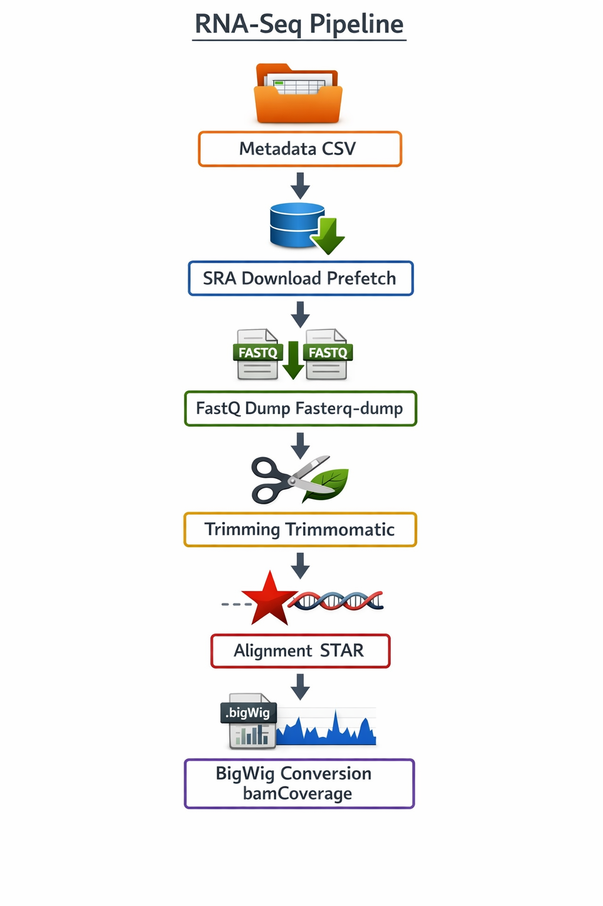

```{r setup, include=FALSE}
knitr::opts_chunk$set(echo = TRUE, eval = FALSE, message = FALSE, warning = FALSE)
```

---

**Purpose:** Provide lab collaborators and peers with a single, reproducible workflow for downloading public RNA-seq datasets from SRA and producing normalized coverage tracks for visual inspection in IGV or any genome browser.

**Approach:** Four-stage bash pipeline — SRA download → adapter trimming → splice-aware alignment → CPM-normalized BigWig generation. Driven by a metadata CSV and configured through a single environment file so it can be shared, versioned, and re-run without modifying any scripts.

**Toolchain:** SRA Toolkit (`prefetch`, `fasterq-dump`), Trimmomatic, STAR, samtools, deepTools (`bamCoverage`).

**Output:** Per-sample CPM-normalized `.bw` files organized by cell type, ready for immediate loading into IGV alongside any reference annotation track.

---

## 1. Overview

The pipeline takes a metadata CSV listing SRA run accessions and produces a structured results directory with FASTQ, trimmed FASTQ, BAM, BigWig, and log files grouped by cell type. Each stage can be skipped independently, so re-running after a failure or adding new samples does not require reprocessing everything from scratch.

```{r fig-overview, eval=TRUE, echo=FALSE, fig.cap="Pipeline stages: metadata-driven SRA download feeds into per-sample FASTQ extraction, Trimmomatic quality trimming, STAR alignment, and deepTools CPM normalization to produce BigWig tracks."}

```

The repository exposes three entry points:

- **`launch.sh`** — runs download + processing end-to-end; the typical starting point
- **`download_data.sh`** — SRA download stage only
- **`processing_pipeline.sh`** — processing stage only; useful when SRA files already exist

## 2. Configuration

All tunable settings live in `config/pipeline.env`. Copy the included template and edit it once; no script modifications are needed to run on a new machine or a different reference genome.

```bash
# Copy template and customize
cp config/pipeline.env.example config/pipeline.env
$EDITOR config/pipeline.env
```

Key settings in the config file:

```bash
# --- Paths ---
METADATA_FILE="metadata.csv"        # CSV listing samples to process
SRA_OUTPUT_DIR="sra_files"          # Where prefetch writes .sra archives
BASE_DIR="results"                  # Root output directory

# --- Tool executables (absolute paths or names on PATH) ---
STAR_EXEC="STAR"
STAR_INDEX="/path/to/star_index"    # Pre-built STAR genome index
TRIMMOMATIC_EXEC="trimmomatic"
SAMTOOLS_BIN="samtools"
BAMCOVERAGE_BIN="bamCoverage"
FASTERQ_DUMP_BIN="fasterq-dump"

# --- Resource tuning ---
ALIGN_THREADS=6                     # STAR alignment threads
IO_THREADS=4                        # fasterq-dump / bamCoverage threads
STAR_OVERHANG=100                   # Set to (read_length - 1) for non-150bp reads

# --- Coverage normalization ---
EFFECTIVE_GENOME_SIZE=2652783500    # mm10; use 2913022398 for hg38
BW_BIN_SIZE=10                      # BigWig resolution in bp
BW_NORMALIZATION=CPM                # CPM, RPGC, BPM, or NONE

# --- Optional extra arguments passed through to each tool ---
STAR_EXTRA_ARGS=""
TRIMMOMATIC_EXTRA_ARGS=""
BAMCOVERAGE_EXTRA_ARGS=""
KEEP_TMP=0                          # Set to 1 to retain intermediate scratch files
```

Verify all required tools are available before the first run:

```bash
for tool in prefetch fasterq-dump STAR trimmomatic samtools bamCoverage; do
  if command -v "${tool}" >/dev/null 2>&1; then
    printf "FOUND    %s -> %s\n" "${tool}" "$(command -v "${tool}")"
  else
    printf "MISSING  %s (check conda env or set path in config)\n" "${tool}"
  fi
done
```

## 3. Metadata

The pipeline is driven entirely by `metadata.csv`. The only required columns are `CellType`, `RunID`, and `Description`; additional columns are ignored, making it easy to extend with project-specific annotations.

```
CellType,RunID,StudyID,Description,SeqType,Year
T_cells,SRR17143399,SRP349422,ABAT cKO CD4 T cells (GSE190818),PE150,2022
T_cells,SRR17143398,SRP349422,ABAT cKO CD4 T cells (GSE190818),PE150,2022
B_cells,SRR9274997,SRP162233,B cells stimulated with LPS (GSE117428),PE150,2019
Macrophages,SRR31668386,SRP550593,Alveolar Macrophages (GSM8675173),,2024
```

`download_data.sh` validates these columns with Python before any downloads begin, so missing headers surface immediately rather than mid-run:

```python
import csv, sys
required = {"CellType", "RunID", "Description"}
with open(metadata_path) as f:
    reader = csv.DictReader(f)
    missing = required - set(reader.fieldnames or [])
    if missing:
        sys.exit(f"Missing required columns: {missing}")
```

## 4. SRA Download

`download_data.sh` iterates each row of the metadata and calls `prefetch` for the listed `RunID`. Files already present in `SRA_OUTPUT_DIR` are skipped, so re-running after adding new rows only fetches the new accessions.

Use `--dry-run` to log what would be downloaded without touching the filesystem — useful for verifying accessions and estimating disk requirements before pulling multi-GB archives:

```bash
# Validate accessions and print planned downloads
./download_data.sh --dry-run

# Download when ready (each .sra file up to 50 GB)
./download_data.sh
```

Internally, each accession is fetched with:

```bash
prefetch "${run_id}" \
  --output-directory "${SRA_OUTPUT_DIR}" \
  --max-size 50G
```

## 5. FASTQ Extraction and Quality Trimming

`processing_pipeline.sh` handles the per-sample stages. After prefetch, `fasterq-dump` converts each `.sra` archive to paired-end FASTQ files:

```bash
fasterq-dump "${sra_file}" \
  --split-3 \
  --outdir "${fastq_dir}" \
  --temp "${tmp_dir}/fasterq" \
  --threads "${IO_THREADS}"
```

`--split-3` writes paired reads to `_1.fastq` / `_2.fastq` and unpaired reads to a third file, which is discarded. Trimmomatic then removes Illumina adapters and low-quality bases:

```bash
trimmomatic PE \
  "${r1_fastq}" "${r2_fastq}" \
  "${r1_trimmed}" /dev/null \
  "${r2_trimmed}" /dev/null \
  ILLUMINACLIP:"${ADAPTERS}":2:30:10 \
  LEADING:3 TRAILING:3 \
  SLIDINGWINDOW:4:15 \
  MINLEN:36
```

Key parameters:
- `ILLUMINACLIP:2:30:10` — up to 2 seed mismatches; palindrome clip threshold 30; simple clip threshold 10
- `SLIDINGWINDOW:4:15` — scan 4-bp windows; trim when mean quality drops below Q15
- `MINLEN:36` — discard reads shorter than 36 bp after trimming
- Unpaired outputs go to `/dev/null`; only properly paired reads proceed to alignment

## 6. Alignment and Coverage Normalization

STAR aligns the trimmed paired-end reads to the indexed reference genome. The output is a coordinate-sorted BAM, indexed immediately by samtools:

```bash
STAR \
  --runThreadN "${ALIGN_THREADS}" \
  --genomeDir "${STAR_INDEX}" \
  --readFilesIn "${r1_trimmed}" "${r2_trimmed}" \
  --outSAMtype BAM SortedByCoordinate \
  --outSAMattributes All \
  --sjdbOverhang "${STAR_OVERHANG}" \
  --outBAMcompression 1 \
  --outTmpDir "${tmp_dir}/star/tmp" \
  --outFileNamePrefix "${bam_prefix}" \
  ${STAR_EXTRA_ARGS}

samtools index "${bam_file}"
```

STAR logs (`Log.final.out`, `SJ.out.tab`) are moved to `logs/` for per-sample QC review. The splice junction file is particularly useful for confirming that the correct organism/annotation was used.

Finally, `bamCoverage` from deepTools converts the BAM to a CPM-normalized BigWig at 10 bp resolution:

```bash
bamCoverage \
  --bam "${bam_file}" \
  --outFileName "${bw_file}" \
  --binSize "${BW_BIN_SIZE}" \
  --normalizeUsing "${BW_NORMALIZATION}" \
  --effectiveGenomeSize "${EFFECTIVE_GENOME_SIZE}" \
  --numberOfProcessors "${IO_THREADS}" \
  ${BAMCOVERAGE_EXTRA_ARGS}
```

CPM normalization divides each bin's read count by total mapped reads (in millions), enabling direct visual comparison of coverage tracks across samples with different sequencing depths.

## 7. Summary

After a successful run, each cell type in the metadata has a directory under `BASE_DIR`:

```
results/
└── T_cells/
    ├── fastq/        SRR17143399_1.fastq, SRR17143399_2.fastq
    ├── trimmed/      SRR17143399_1_trimmed.fastq, SRR17143399_2_trimmed.fastq
    ├── bam/          SRR17143399.bam, SRR17143399.bam.bai
    ├── bw/           SRR17143399.bw
    └── logs/         Log.final.out, SJ.out.tab, ...
```

Load the `.bw` files directly into IGV (`File → Load from File`) alongside a reference annotation (GTF/BED) to inspect coverage at any locus of interest. Because all tracks are CPM-normalized, height scales are directly comparable across samples and studies.

Source code and setup instructions: [github.com/jsdearbo/SRA_to_BigWigs](https://github.com/jsdearbo/SRA_to_BigWigs)
