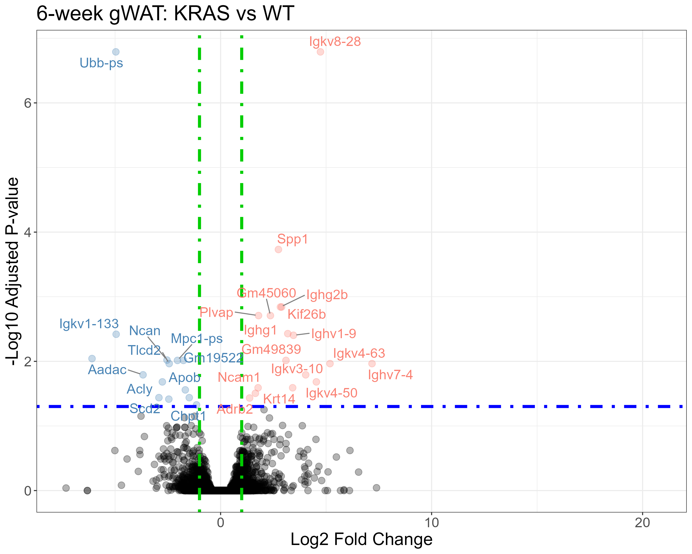
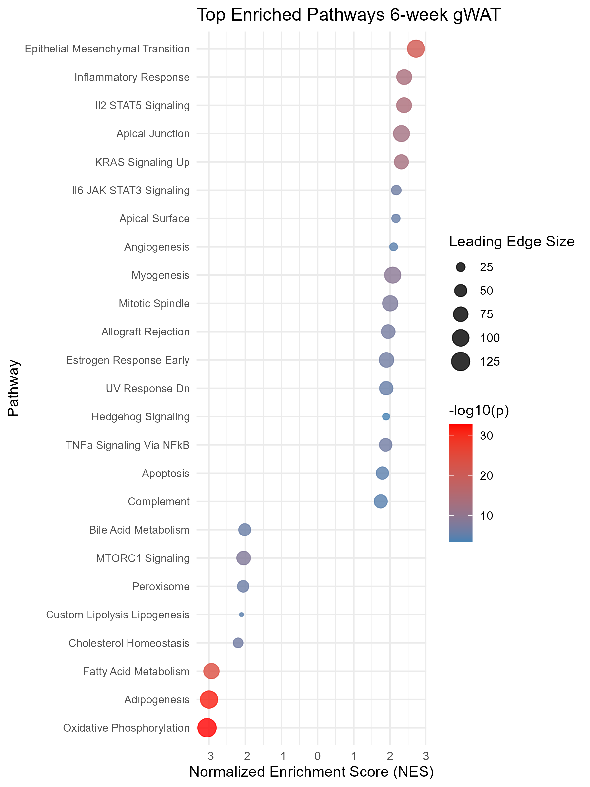

```{r setup, include=FALSE}
knitr::opts_chunk$set(echo = TRUE, eval = FALSE, message = FALSE, warning = FALSE)
```

---

**Question:** Does systemic KRAS activation alter adipose tissue transcriptomes in a way consistent with early cancer cachexia, and which gene programs are gained or lost?

**Data:** Bulk RNA-seq from gonadal white adipose tissue (gWAT) and brown adipose tissue (BAT) of Kras^G12D/+^ and WT littermate mice at 3 weeks and 6 weeks post-induction (n = 3 per group; 24 samples total, 4 tissue × timepoint comparisons).

**Methods:** DESeq2 per-comparison differential expression; volcano plot visualization with labeled DEGs; ranked GSEA using fgsea with the MSigDB Hallmark mouse gene set.

**Result:** At 6 weeks, KRAS gWAT shows strong downregulation of adipogenic and lipid metabolism programs (Adipogenesis Hallmark NES = −3.0, padj < 10^−30^) and concurrent upregulation of inflammatory, EMT, and JAK/STAT programs — a transcriptional signature of early adipocyte dedifferentiation consistent with cachexia.

---

## 1. Data Loading

The experiment used RNA-seq count matrices generated by featureCounts from STAR-aligned BAM files. Columns were renamed to structured sample identifiers (timepoint_tissue_genotype_replicate) using a sample key.

```{r load-data}
library(DESeq2)
library(biomaRt)
library(ggplot2)
library(ggrepel)

# Load count matrix
data <- read.table("feature_counts/batched/all_sample_counts.txt",
                   header = TRUE, row.names = 1)

# Strip path prefixes from column names
colnames(data) <- gsub("X.bobross.jdearborn.analysis.RNA_seq.TM01.bam.", "", colnames(data))
colnames(data) <- gsub(".bam", "", colnames(data))

# Rename using sample key (maps S01 → 3wk_BAT_WT_1, etc.)
sample_key <- read.table("R_scripts/sample_key.csv", header = TRUE, sep = ",")
for (i in seq_len(nrow(sample_key))) {
  colnames(data)[colnames(data) == sample_key$Sample[i]] <- sample_key$Condition[i]
}

# Drop featureCounts annotation columns, keep count columns only
raw_counts <- data[, -c(1:5)]
```

## 2. Sample Metadata

Metadata is parsed from the structured column names and stored as a data frame. The original "KO" label reflects the conditional allele; it is relabeled "KRAS" throughout for clarity.

```{r metadata}
colnames_data <- colnames(raw_counts)

sample_metadata <- data.frame(
  sample_name = colnames_data,
  condition   = colnames_data,
  stringsAsFactors = FALSE
)

# Parse structured IDs into factor columns
sample_metadata$timepoint <- gsub("(.+)_(.+)_(.+)_(.+)", "\\1", sample_metadata$condition)
sample_metadata$tissue    <- gsub("(.+)_(.+)_(.+)_(.+)", "\\2", sample_metadata$condition)
sample_metadata$genotype  <- gsub("(.+)_(.+)_(.+)_(.+)", "\\3", sample_metadata$condition)
sample_metadata$replicate <- gsub("(.+)_(.+)_(.+)_(.+)", "\\4", sample_metadata$condition)
sample_metadata$group     <- paste(sample_metadata$timepoint, sample_metadata$tissue,
                                   sample_metadata$genotype, sep = "_")

# Relabel conditional KRAS allele
sample_metadata$genotype[sample_metadata$genotype == "KO"] <- "KRAS"
sample_metadata$group <- gsub("_KO$", "_KRAS", sample_metadata$group)
```

The 24 samples span 4 comparisons: 3wk BAT, 3wk gWAT, 6wk BAT, 6wk gWAT — each with n = 3 KRAS and n = 3 WT replicates.

## 3. DESeq2 Differential Expression

Each comparison is modeled independently. Subsetting before model fitting avoids confounding by tissue and timepoint; `DESeq()` with a `~ genotype` design estimates KRAS vs. WT contrasts within each group. Gene symbols are added via biomaRt after stripping Ensembl version suffixes.

```{r deseq-function}
run_deseq_subset <- function(timepoint, tissue,
                              ref_genotype = "WT", test_genotype = "KRAS") {
  group_ref  <- paste(timepoint, tissue, ref_genotype,  sep = "_")
  group_test <- paste(timepoint, tissue, test_genotype, sep = "_")

  metadata_sub <- sample_metadata[sample_metadata$group %in% c(group_ref, group_test), ]
  metadata_sub$genotype <- factor(metadata_sub$genotype, levels = c(ref_genotype, test_genotype))

  counts_sub <- raw_counts[, metadata_sub$sample_name]

  dds <- DESeqDataSetFromMatrix(countData = counts_sub,
                                colData   = metadata_sub,
                                design    = ~ genotype)
  dds <- DESeq(dds)
  res <- results(dds, contrast = c("genotype", test_genotype, ref_genotype))
  return(list(dds = dds, res = res))
}
```

```{r run-deseq}
res_3wk_BAT  <- run_deseq_subset("3wk", "BAT")
res_3wk_gWAT <- run_deseq_subset("3wk", "gWAT")
res_6wk_BAT  <- run_deseq_subset("6wk", "BAT")
res_6wk_gWAT <- run_deseq_subset("6wk", "gWAT")
```

```{r annotate}
# Add gene symbols via biomaRt
ensembl <- useMart("ensembl", dataset = "mmusculus_gene_ensembl")

annotate_results <- function(res, mart) {
  rownames(res) <- gsub("\\..*", "", rownames(res))  # strip version
  gene_names <- getBM(
    attributes = c("ensembl_gene_id", "external_gene_name"),
    filters    = "ensembl_gene_id",
    values     = rownames(res),
    mart       = mart
  )
  res_df <- as.data.frame(res)
  res_df$symbol <- gene_names$external_gene_name[match(rownames(res_df), gene_names$ensembl_gene_id)]
  res_df$symbol[is.na(res_df$symbol)] <- rownames(res_df)[is.na(res_df$symbol)]
  return(res_df)
}

res_6wk_gWAT_df <- annotate_results(res_6wk_gWAT$res, ensembl)
```

## 4. Volcano Plot — 6-Week gWAT

The volcano below plots all expressed genes for the 6wk gWAT KRAS vs. WT comparison. Genes with |LFC| > 1 and padj < 0.05 are highlighted; the top DEGs in each direction are labeled.

Downregulated hits (blue) include lipid metabolism and adipocyte identity genes (*Acly*, *Scd1*, *Apob*). Upregulated hits (pink) are dominated by immunoglobulin-class genes and *Spp1*, consistent with immune infiltration.

```{r volcano-plot}
create_volcano_plot <- function(res_df, title,
                                padj_cutoff = 0.05, lfc_cutoff = 1) {
  res_df$diffexpressed <- "Not Sig"
  res_df$diffexpressed[res_df$log2FoldChange >  lfc_cutoff & res_df$padj < padj_cutoff] <- "Up"
  res_df$diffexpressed[res_df$log2FoldChange < -lfc_cutoff & res_df$padj < padj_cutoff] <- "Down"

  # Label top 15 DEGs in each direction
  res_df$delabel <- NA
  top_up   <- head(res_df[res_df$diffexpressed == "Up",   ][order(res_df[res_df$diffexpressed == "Up",   "padj"]), ], 15)
  top_down <- head(res_df[res_df$diffexpressed == "Down", ][order(res_df[res_df$diffexpressed == "Down", "padj"]), ], 15)
  res_df$delabel[rownames(res_df) %in% rownames(top_up)]   <- res_df$symbol[rownames(res_df) %in% rownames(top_up)]
  res_df$delabel[rownames(res_df) %in% rownames(top_down)] <- res_df$symbol[rownames(res_df) %in% rownames(top_down)]

  ggplot(res_df, aes(x = log2FoldChange, y = -log10(padj),
                     col = diffexpressed, label = delabel)) +
    geom_point(size = 1) +
    geom_hline(yintercept = -log10(padj_cutoff), linetype = "dashed", color = "blue") +
    geom_vline(xintercept = c(-lfc_cutoff, lfc_cutoff), linetype = "dashed", color = "darkgreen") +
    scale_color_manual(values = c("Down" = "steelblue", "Not Sig" = "gray80", "Up" = "salmon")) +
    geom_text_repel(max.overlaps = 15, size = 3) +
    labs(title = title, x = "Log2 Fold Change", y = "−Log10 Adjusted P-value",
         color = "Direction") +
    theme_bw() +
    theme(panel.grid.major = element_blank(), panel.grid.minor = element_blank(),
          legend.position = "top")
}

p_volcano <- create_volcano_plot(res_6wk_gWAT_df, "6-week gWAT: KRAS vs WT")
```

```{r fig-volcano, eval=TRUE, echo=FALSE, fig.cap="Volcano plot — 6-week gWAT KRAS vs. WT. Blue: downregulated lipid metabolism and adipocyte genes. Pink: upregulated immunoglobulin and immune infiltration markers."}

```

## 5. Gene Set Enrichment Analysis

GSEA was run with fgsea using the MSigDB Hallmark mouse gene sets (mh.all.v2024.1.Mm.symbols.gmt). Genes are ranked by the DESeq2 Wald statistic — this captures both effect size and significance. The top 25 terms by p-value are plotted; bubble size encodes leading-edge gene count, color encodes −log10(p).

```{r gsea-setup}
library(fgsea)
library(dplyr)
library(stringr)

run_fgsea <- function(results_df, gmt_file,
                      gene_id_column = NULL, stat_column = "stat",
                      minSize = 15, maxSize = 500) {
  res_df <- results_df %>%
    dplyr::select(all_of(c(stat_column, "log2FoldChange", "pvalue"))) %>%
    na.omit()

  if (!is.null(gene_id_column) && gene_id_column %in% colnames(results_df)) {
    res_df$SYMBOL <- results_df[rownames(res_df), gene_id_column]
  } else {
    res_df$SYMBOL <- rownames(res_df)
  }

  res_df <- res_df %>%
    filter(!is.na(SYMBOL), SYMBOL != "") %>%
    distinct(SYMBOL, .keep_all = TRUE)

  ranks <- setNames(res_df[[stat_column]], res_df$SYMBOL)
  ranks <- sort(ranks, decreasing = TRUE)

  pathways <- gmtPathways(gmt_file)
  fgsea(pathways = pathways, stats = ranks, minSize = minSize, maxSize = maxSize)
}
```

```{r gsea-run}
fgsea_6wk_gWAT <- run_fgsea(
  results_df     = res_6wk_gWAT_df,
  gmt_file       = "mh.all.v2024.1.Mm.symbols.gmt",
  gene_id_column = "symbol"
)
```

```{r gsea-plot}
# Clean pathway names
fix_names <- function(p) {
  p <- gsub("HALLMARK_|CUSTOM_", "", p)
  p <- stringr::str_to_title(gsub("_", " ", tolower(p)))
  for (term in c("TNF", "KRAS", "UV", "G2M", "E2F", "NFkB", "JAK", "STAT", "MTORC")) {
    p <- gsub(paste0("(?i)", term), term, p, perl = TRUE)
  }
  p
}

top25 <- fgsea_6wk_gWAT[order(fgsea_6wk_gWAT$pval), ][1:25, ]
top25$leadingEdge_size <- sapply(top25$leadingEdge, length)
top25$neglog10p <- -log10(top25$pval)
top25$pathway   <- fix_names(top25$pathway)

p_gsea <- ggplot(top25, aes(x = NES, y = reorder(pathway, NES),
                             size = leadingEdge_size, color = neglog10p)) +
  geom_point(alpha = 0.8) +
  scale_color_gradient(low = "steelblue", high = "red", name = "−log10(p)") +
  scale_size_continuous(name = "Leading Edge Size") +
  theme_minimal() +
  labs(title = "Top Enriched Pathways — 6-week gWAT",
       x = "Normalized Enrichment Score (NES)", y = "Pathway") +
  theme(axis.text.y = element_text(size = 8), legend.position = "right")
```

```{r fig-gsea, eval=TRUE, echo=FALSE, fig.cap="GSEA bubble plot — 6-week gWAT KRAS vs. WT. Right (positive NES): EMT, Inflammatory Response, KRAS Signaling, IL6/JAK/STAT3. Left (negative NES): Adipogenesis (NES = −3.0, padj < 10^−30^), Oxidative Phosphorylation, Fatty Acid Metabolism."}

```

## 6. Summary

The 6-week gWAT comparison produces the clearest cachexia signal. KRAS-expressing mice show:

- **Loss of adipocyte identity**: Adipogenesis is the most significantly depleted Hallmark term (NES = −3.0, padj < 10^−30^). Lipid synthesis and fatty acid metabolism gene programs are co-depleted.
- **Immune infiltration**: The volcano plot shows upregulation of immunoglobulin genes (Igkv/Ighg family) and *Spp1*, and the GSEA shows Inflammatory Response, Allograft Rejection, and Il2/STAT5 signaling enriched in KRAS vs. WT.
- **Oncogenic signaling**: KRAS Signaling Up and Il6/JAK/STAT3 are both enriched, consistent with systemic cytokine-driven transcriptional changes.
- **EMT**: Epithelial-Mesenchymal Transition is the top positively enriched term (NES = +3.0) — consistent with stromal remodeling accompanying early cachexia.

This bulk RNA-seq analysis contributed to the Shiny interactive explorer published as Supplemental Figure S9 in Snoke et al., *Cell Reports* (2025). DOI: [10.1016/j.celrep.2025.116278](https://doi.org/10.1016/j.celrep.2025.116278).
